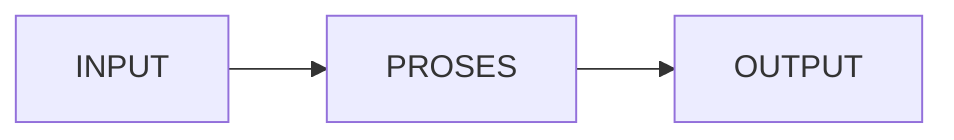

# Rangkuman-Logika-C-SQL-Server---Amunisi-LKS-Aplikasi-Game

## Deskripsi

Dokumentasi ini adalah rangkuman materi **C# dan SQL Server** yang Faris pelajari untuk persiapan **LKS (Lomba Kompetensi Siswa)** bidang aplikasi game.

Materi yang dicakup:

- Mekanisme Logika IF (pintu gerbang akses data)
- SqlConnection sebagai jembatan ke database SQL Server
- Alur Input (TextBox) → Proses (SELECT query) → Output (MessageBox)
- Contoh kode dan analogi sederhana

> Amunisi ini disiapkan agar Faris bisa fokus bikin game tanpa takut lupa logika dasarnya.

---

# Rangkuman Logika C# & SQL Server - Amunisi Game LKS Faris

## 📋 Daftar Isi

- [2. Mekanisme Logika IF (Mencocokkan Kunci)](#2-mekanisme-logika-if-mencocokkan-kunci)
- [3. Jembatan Database (SqlConnection)](#3-jembatan-database-sqlconnection)
- [4. Alur Input-Proses-Output](#4-alur-input-proses-output)
- [Ringkasan Cepat](#ringkasan-cepat)

---

## 2. Mekanisme Logika IF (Mencocokkan Kunci)

### Konsep

Kode `if (dr.HasRows)` di C# itu ibarat **pintu gerbang**.

| Kondisi | Hasil |
|---------|-------|
| Jika data (Username/Password) ketemu di database | ✅ Akses diberikan |
| Jika data tidak ditemukan | ❌ Akses ditolak |

### Catatan Penting

Konsep ini **sama** di JavaScript dan Python, cuma beda cara nulisnya:

| Bahasa | Penulisan IF |
|--------|--------------|
| **C#** | `if (kondisi) { }` |
| **JavaScript** | `if (kondisi) { }` |
| **Python** | `if kondisi :` (tanpa kurung kurawal) |

---

## 3. Jembatan Database (SqlConnection)

### Syntax Dasar

```csharp
SqlConnection connection = new SqlConnection("Data Source=localhost;Initial Catalog=hotelnew;Integrated Security=True");
```

Komponen Connection String

Bagian Keterangan
Data Source Lokasi server database (contoh: localhost)
Initial Catalog Nama database yang digunakan (contoh: hotelnew)
Integrated Security Mode autentikasi (True = pakai login Windows)

Fungsi

Koneksi ini adalah jembatan antara aplikasi C# dengan database SQL Server.

Manfaat untuk Game

Data Game Contoh
Simpan level pemain Level 5
Inventory barang Pedang, Potion, Shield
Progress pemain Save point terakhir

Dengan database, data tidak hilang ketika game ditutup!

---

4. Alur Input-Proses-Output

Diagram Alur



Penjelasan

Tahap Kode C# Keterangan
INPUT tbNama.Text Mengambil teks dari kotak isian (TextBox)
PROSES SELECT * FROM ... Mengecek data ke database menggunakan perintah SQL
OUTPUT MessageBox.Show() Memberi tahu user hasilnya lewat kotak pesan

Contoh Kode

```csharp
// INPUT
string username = tbNama.Text;

// PROSES
string query = "SELECT * FROM users WHERE username = @username";
SqlCommand cmd = new SqlCommand(query, connection);
cmd.Parameters.AddWithValue("@username", username);

// OUTPUT
if (reader.HasRows)
{
    MessageBox.Show("Login berhasil!");
}
else
{
    MessageBox.Show("Username tidak ditemukan!");
}
```

---

Ringkasan Cepat

Komponen Fungsi Contoh
IF Percabangan logika if (dr.HasRows) { }
SqlConnection Koneksi ke database SQL Server new SqlConnection("...")
TextBox.Text Input dari user tbNama.Text
MessageBox Output ke user MessageBox.Show("...")
SELECT Query mengambil data SELECT * FROM users

---

📁 Folder Penyimpanan

Simpan rangkuman ini di:

```
📁 Persiapan Lomba Game/
   ├── 📄 Rangkuman C# SQL Server.md
   ├── 📄 Latihan Koneksi Database.md
   └── 📄 Draft Game Concept.md
```

---

Dokumentasi ini disusun untuk keperluan LKS (Lomba Kompetensi Siswa) - Aplikasi C# dengan SQL Server.
